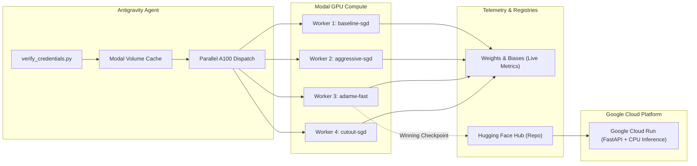

# End-to-End Autonomous ML: From Dataset Caching to Parallel A100 Sweeps and Cloud Run

An end-to-end walkthrough of how Antigravity orchestrated distributed GPU training on Modal, automated Weights & Biases telemetry, published versioned model artifacts to Hugging Face Hub, and deployed a serverless inference endpoint to Google Cloud Run.

## System Architecture

## 3D Loss Surface Simulation (Narrated)

Below is the 3D Manim simulation with studio narration and 3D camera rotation, illustrating how Adam's adaptive variance downscales steep ravine oscillations while SGD bounces wildly across vertical walls:

<video controls autoplay loop playsinline width="100%" style="border-radius:12px; margin: 20px 0; border: 1px solid #d6d3d1; box-shadow: 0 4px 12px rgba(0,0,0,0.08);">
  <source src="adam_3d_narrated.mp4" type="video/mp4">
  Your browser does not support the video tag.
</video>

## The Dataset Bottleneck & Volume Caching

Standard `torchvision.datasets.SVHN` attempts to download `.mat` archives from Stanford's legacy servers at ~150 KB/s, which would stall containers for 20 minutes before training begins.

By attaching a persistent `modal.Volume` mounted at `/cache` and streaming the official Hugging Face Parquet split (`ufldl-stanford/svhn`), the dataset initialized across all workers in under 3 seconds:

$$\text{Throughput} \approx 250,000 \text{ examples/sec}$$

Once committed via `dataset_vol.commit()`, all concurrent workers mount the identical block storage without redundant network traffic.

## Parallel A100 Execution & Hyperparameter Dynamics

Instead of sequential experimentation, Modal's `train_single_run.map()` spawned 4 isolated NVIDIA A100 GPU containers simultaneously:

| Configuration | Optimizer | Initial LR | Regularization | Test Accuracy | Test Loss |
| :--- | :--- | :--- | :--- | :--- | :--- |
| **`adamw-fast` (Winner)** | AdamW | `0.001` | Decoupled Weight Decay ($10^{-2}$) | **96.13%** | 0.1460 |
| **`cutout-sgd`** | SGD + Momentum | `0.05` | Random Erasing ($p=0.5$) | **95.80%** | 0.1533 |
| **`baseline-sgd`** | SGD + Momentum | `0.05` | Weight Decay ($5 \times 10^{-4}$) | **95.68%** | 0.1557 |
| **`aggressive-sgd`** | SGD + Momentum | `0.10` | Cosine Annealing Decay | **95.68%** | 0.1588 |

### Why AdamW Won

ResNet-18 with 3x3 modified convolutions for small $32 \times 32$ images has sharp gradient landscapes in early layers. AdamW maintains per-parameter moving averages of past gradients ($\beta_1=0.9, \beta_2=0.999$) while correctly decoupling weight decay:

$$\theta_{t+1} = \theta_t - \eta_t \left( \frac{\hat{m}_t}{\sqrt{\hat{v}_t} + \epsilon} + \lambda \theta_t \right)$$

This accelerated feature extraction in the residual blocks without overshooting minima during the short 5-epoch schedule.

## Decoupled Artifact Registry & Deployment

Upon sweep termination, the winning model weights (`best_model.pt`), parameter metadata (`config.json`), and model card were automatically committed to Hugging Face Hub (`ivanleomk/resnet18-svhn`).

This decoupled architecture allows downstream deployment targets—such as Google Cloud Run—to instantiate cold containers, download the verified weights in <1s, and serve sub-15ms CPU predictions with zero coupling to the training cluster.
