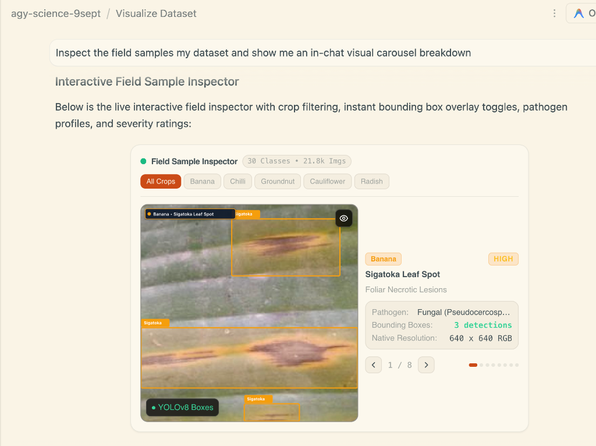

# Antigravity Skills Demo: Planet & Agricultural Landscape Understanding

An end-to-end showcase of autonomous AI agent workflows in **Google Antigravity** orchestrating scientific literature discovery, geospatial dataset exploration, multi-modal visual explainers, local model training, and edge deployment.

---

## 🚀 Quickstart: Prompts to Run in Antigravity

Follow these three consecutive prompts in Antigravity to reproduce the discovery, dataset inspection, and interactive explainer pipeline:

### 1. Literature Discovery & Search
Ask Antigravity to discover state-of-the-art research papers on continental-scale agricultural landscape delineation:

```text
/literature-search-arxiv find me papers about agriculture landscape understanding
```

> [!NOTE]
> Ensure you have the Antigravity default science skills installed (specifically [`literature-search-arxiv`](file:///Users/gabbyong/.gemini/config/plugins/science/skills/literature_search_arxiv/SKILL.md)).

**Outputs produced:**
- `agri-landscape-paper.pdf` (*Smallholder Agricultural Landscape Understanding at a National Scale*, Dua et al., Google DeepMind & Google Research, KDD '26 / arXiv:2411.05359).
- `farmlevel-paper-paper.pdf` (*Farm-Level, In-Season Crop Identification for India*, Deshpande et al., Google DeepMind / arXiv:2507.02972).

---

### 2. Dataset Visual Inspection & In-Chat Carousel Breakdown
Attach or reference the multicrop field benchmark and prompt Antigravity to inspect and categorize the samples:

```text
Inspect the field samples my multicrop disease dataset and show me an in-chat visual carousel breakdown
```

**Outputs produced:**
- **Interactive Field Sample Inspector**: An in-chat dynamic carousel parsing 30 disease classes across 21.8k images (Banana, Chilli, Groundnut, Cauliflower, Radish) with instant YOLOv8 bounding box toggles, pathogen profiles, and severity ratings.
- Documented in [`examples/visualize-dataset/multicrop-disease/`](examples/visualize-dataset/multicrop-disease/).



---

### 3. Interactive Visual Explanation & 3Blue1Brown Explainer Video
Reference Figure 1 of the discovered paper to generate a multi-modal interactive explainer and narrated animation:

```text
Create an interactive visual explanation of the processing steps in Figure 1 of [agri-landscape-paper.pdf] paper in illustration style.
create a 3Blue1Brown style explainer video with narration
```

**Outputs produced:**
- Self-contained showcase package in [`examples/explain/alu/`](examples/explain/alu/):
  - **`index.html`**: Standalone web application featuring a 5-step pipeline stepper, interactive dagger removal widget (Algorithm 4), dark/light themes, and self-checking quiz.
  - **`content.md`**: Complete 20 KB mathematical writeup and 32-second synchronized narration script.
  - **`alu_figure1_storytelling.mp4`**: 3Blue1Brown-style 60fps dark-mode motion graphics.
  - **`alu_figure1_narrated.mp4`**: Muxed video with 32-second synchronized voiceover narration.
  - **`alu_figure1_narration.m4a`**: Standalone narration audio track.
  - **`xiaohei_figure1_alu.jpg`**: Hand-drawn illustration in Xiaohei style anchoring the pipeline concepts.
  - **`generate_narration_video.py`**: Python script synthesizing narration via macOS TTS and muxing audio/video.

---

## 📂 Folder Organization & Output Files

```text
agy-planet-skills-demo/
├── README.md                                          # This guide & quickstart prompts
├── assets/
│   └── multicrop_inspector_carousel.png               # [Output: Prompt 2] In-chat visual carousel screenshot
├── .agents/
│   └── skills/                                        # Antigravity Skills definitions
│       ├── explain/                                   # Skill: Interactive HTML & video explainers
│       ├── visualize-dataset/                         # Skill: Slicing & in-chat visual carousels
│       ├── train-model/                               # Skill: Local micro-runs & PyTorch training
│       └── google-cloud/                              # Skill: FastAPI containerization & Cloud Run deploy
└── examples/
    ├── README.md                                      # Showcase directory index & local server instructions
    │
    ├── visualize-dataset/
    │   └── multicrop-disease/                         # [Output: Prompt 2] Dataset inspection showcase
    │       ├── README.md                              # Class breakdown, YOLO annotations, pathogen profiles
    │       └── multicrop_inspector_carousel.png       # Live inspector screenshot
    │
    └── explain/
        ├── alu/                                       # [Output: Prompt 3] Agricultural Landscape Understanding
        │   ├── index.html                             # Interactive single-page web explainer
        │   ├── content.md                             # Technical breakdown & narration script
        │   ├── alu_figure1_storytelling.mp4           # 3B1B motion graphics video
        │   ├── alu_figure1_narrated.mp4               # Synchronized narrated walkthrough video
        │   ├── alu_figure1_narration.m4a              # Standalone narration audio track
        │   ├── xiaohei_figure1_alu.jpg                # Hand-drawn pipeline storyboard illustration
        │   └── generate_narration_video.py            # Narration synthesis & muxing script
        │
        ├── agent-harness/                             # Systems architecture explainer
        ├── cnn/                                       # Convolutional neural network explainer
        ├── llm-training/                              # Pretraining, SFT, and RLHF explainer
        └── resnet-18/                                 # ResNet-18 residual learning explainer
```

---

## 🖥️ How to Serve and Demo Locally

Run an HTTP server from the `examples/explain` directory to view all interactive web explainers:

```bash
python3 -m http.server 8080 --directory examples/explain
```

### Direct Links (when server is running):
- **Agricultural Landscape Understanding (ALU)**: [http://localhost:8080/alu/](http://localhost:8080/alu/)
- **Agent Harness**: [http://localhost:8080/agent-harness/](http://localhost:8080/agent-harness/)
- **LLM Training**: [http://localhost:8080/llm-training/](http://localhost:8080/llm-training/)
- **ResNet-18**: [http://localhost:8080/resnet-18/](http://localhost:8080/resnet-18/)

---

## 🛠️ The Core Pipeline

1. **Dataset Exploration (`visualize-dataset`)**: Rapidly slice and inspect benchmarks without heavy upfront downloads. Agents inspect subsets from datasets (such as Multicrop Disease and SVHN) and provide immediate visual feedback using native in-chat carousel components.
2. **Multi-Modal Visual Explainers (`explain`)**: Deliver deep, engaging explanations by generating self-contained interactive HTML artifacts, hand-drawn editorial sketches, and 3Blue1Brown-style motion graphics.
3. **Local Model Training (`train-model`)**: Validate and train models locally using rapid micro-runs on Apple Silicon (`mps`) or CPU before serializing clean PyTorch checkpoints.
4. **Serverless Edge Deployment (`google-cloud`)**: Package trained PyTorch models into lightweight FastAPI services with embedded HTML test canvases, then deploy to Google Cloud Run via `gcloud run deploy`.
