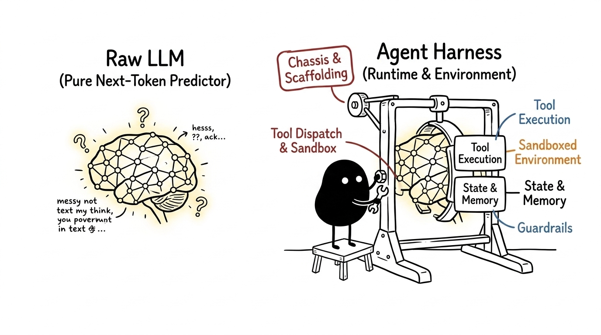
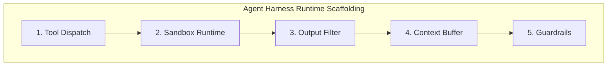
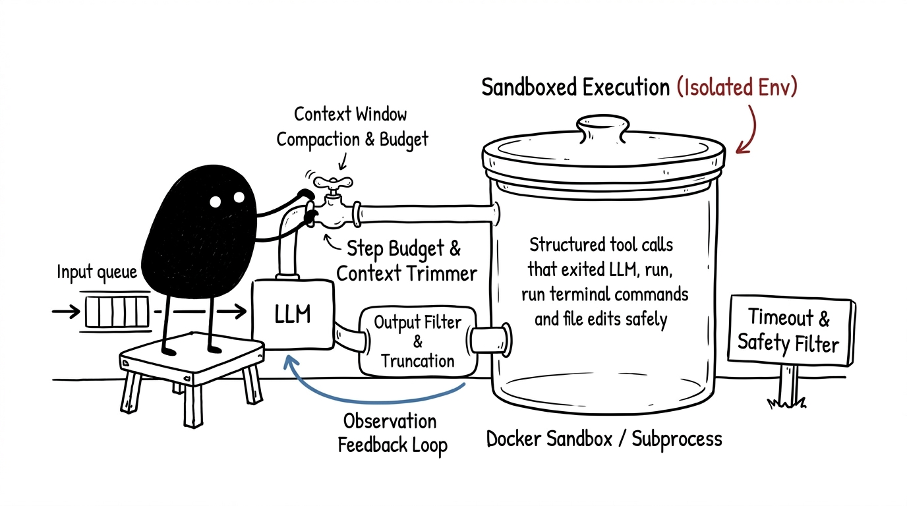
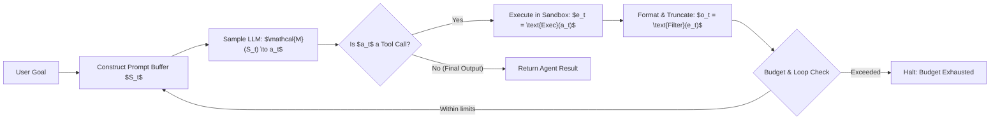

# What is an Agent Harness?

An architectural deep dive into the runtime scaffolding, execution loops, and sandboxing layers that transform pure next-token predictors into reliable autonomous software agents.

## The Mental Model: Engine vs. Chassis

An autoregressive Large Language Model is fundamentally a stateless function: it maps a sequence of token IDs to a probability distribution over the next token ID:

$$P(w_{t} \mid w_{1}, w_{2}, \dots, w_{t-1})$$

A model alone cannot execute a shell command, read a file from a disk sector, observe an exit status code, or enforce a execution budget. When an LLM generates the text string `{"name": "run_bash", "args": {"cmd": "pytest"}}`, nothing actually runs on your computer until an external system parses that JSON, spawns a child process, captures the standard output stream, and packs that output back into the prompt buffer.

That external system is the **Agent Harness**.



If the language model is the engine, the harness is the entire vehicle chassis: the steering linkage, transmission, fuel management, safety cages, and diagnostic sensors. Without the harness, the engine simply revs in an isolated vacuum.

## The Five Pillars of an Agent Harness

Every robust agent harness—whether running production agents like Antigravity, SWE-agent, OpenHands, or benchmark harnesses like SWE-bench—manages five core subsystems:



### 1. Tool Declaration & Dispatch
The harness translates host functions (Python functions, REST endpoints, CLI binaries) into schema definitions that the model understands (typically JSON Schema). When the model emits a structured tool call, the harness intercepts the payload, deserializes arguments, validates types, and dispatches the execution to the appropriate backend.

### 2. Environment Isolation & Sandboxing
Autonomous agents execute arbitrary code, which introduces severe risks of resource exhaustion, unintended file destruction, or rogue network calls. The harness isolates execution within ephemeral sandboxes—such as Docker containers, Firecracker microVMs, temporary Git worktrees, or restricted OS subprocesses with memory and CPU `ulimit` caps.

### 3. Context & Stream Truncation
A single `cat massive_dataset.csv` or recursive directory listing can produce megabytes of output, instantly blowing past context limits or incurring massive token billing. The harness acts as an intelligent buffer: it slices oversized stdout streams, preserves crucial head/tail fragments, and formats the output into clean observation messages.

### 4. Trajectory State & History Management
The harness maintains the append-only conversation trajectory. It sequences system instructions, user turns, assistant reasoning blocks, tool invocations, and environment feedback into the canonical format expected by the target model API.

### 5. Control Loop & Guardrails
Left unconstrained, an LLM encountering an unfamiliar syntax error might loop infinitely, repeatedly running the same broken command. The harness enforces deterministic circuit breakers: maximum step limits ($N_{\text{max}}$), dollar budget thresholds, execution timeouts ($T_{\text{timeout}}$), and regex-based output loop detectors.



## Anatomy of the Execution Loop

The core execution mechanics of an agent harness operate as a synchronous or asynchronous state machine over discrete timesteps $t \in \{1, 2, \dots, T\}$.



At step $t$, the harness constructs state $S_t$ from system instructions, past actions $a_{1:t-1}$, and environment observations $o_{1:t-1}$. The model emits action $a_t$:

$$a_t = \arg\max_{a} P(a \mid S_t)$$

If $a_t$ requests tool execution with timeout $\tau$, the harness executes the action inside the sandbox:

$$o_t = \text{Truncate}\Big(\text{RunSandbox}(a_t, \text{timeout}=\tau), \text{max\_bytes}=K\Big)$$

The observation $o_t$ is appended to the trajectory, the step counter is incremented $t \leftarrow t + 1$, and the loop resumes until the agent signals completion or hits safety thresholds.

## Concrete Implementation: A Minimalist Python Harness

Here is a functional, production-style agent harness implemented in Python that illustrates sandbox timeouts, output truncation, and step budgets without third-party framework overhead:

```python
import json
import subprocess
from dataclasses import dataclass, field
from typing import Any, Callable, Dict, List

@dataclass
class ToolResult:
    stdout: str
    stderr: str
    exit_code: int
    is_truncated: bool = False

class SandboxRunner:
    def __init__(self, workdir: str, timeout_seconds: int = 15, max_output_chars: int = 4000):
        self.workdir = workdir
        self.timeout = timeout_seconds
        self.max_chars = max_output_chars

    def execute_bash(self, command: str) -> ToolResult:
        try:
            proc = subprocess.run(
                command,
                shell=True,
                cwd=self.workdir,
                capture_output=True,
                text=True,
                timeout=self.timeout
            )
            raw_out, raw_err = proc.stdout, proc.stderr
            exit_code = proc.returncode
        except subprocess.TimeoutExpired:
            return ToolResult(
                stdout="",
                stderr=f"Error: Command timed out after {self.timeout}s.",
                exit_code=124
            )

        # Truncate output to preserve LLM context budget
        is_truncated = len(raw_out) > self.max_chars
        if is_truncated:
            half = self.max_chars // 2
            raw_out = f"{raw_out[:half]}\n\n[... Truncated {len(raw_out) - self.max_chars} chars ...]\n\n{raw_out[-half:]}"

        return ToolResult(stdout=raw_out, stderr=raw_err, exit_code=exit_code, is_truncated=is_truncated)

class AgentHarness:
    def __init__(self, sandbox: SandboxRunner, max_steps: int = 10):
        self.sandbox = sandbox
        self.max_steps = max_steps
        self.trajectory: List[Dict[str, Any]] = []

    def run_loop(self, user_goal: str, llm_client: Callable[[List[Dict[str, Any]]], Dict[str, Any]]) -> str:
        self.trajectory.append({"role": "user", "content": user_goal})

        for step in range(1, self.max_steps + 1):
            # 1. Model inference step
            response = llm_client(self.trajectory)
            self.trajectory.append(response)

            # 2. Check if agent finished or made a tool call
            tool_calls = response.get("tool_calls", [])
            if not tool_calls:
                return response.get("content", "Task completed.")

            # 3. Intercept and execute tool calls in sandbox
            for call in tool_calls:
                name = call.get("name")
                args = call.get("arguments", {})

                if name == "bash":
                    res = self.sandbox.execute_bash(args.get("command", ""))
                    obs_payload = {
                        "exit_code": res.exit_code,
                        "stdout": res.stdout,
                        "stderr": res.stderr
                    }
                else:
                    obs_payload = {"error": f"Unknown tool: {name}"}

                # 4. Feed observation back to conversation history
                self.trajectory.append({
                    "role": "tool",
                    "tool_call_id": call.get("id"),
                    "content": json.dumps(obs_payload)
                })

        return "Terminated: Reached maximum step limit."
```

## Runtime Harness vs. Evaluation Harness

In modern AI engineering, the word **harness** is commonly used in two distinct but related contexts:

| Dimension | Production Runtime Harness (e.g. Antigravity / OpenHands) | Benchmark Evaluation Harness (e.g. SWE-bench / GAIA) |
| :--- | :--- | :--- |
| **Primary Goal** | Accomplish user tasks safely in live production environments. | Measure model coding/problem-solving accuracy under standardized conditions. |
| **Environment Lifecycle** | Long-lived workspace or user session with interactive feedback. | Ephemeral container spun up per task instance and immediately torn down. |
| **Verification Method** | User acceptance, linter passes, live manual verification. | Automated unit test suites (`git diff` $\to$ `eval.sh` $\to$ pass/fail matrix). |
| **Data Integrity** | User-facing privacy, security fences, and access control. | Anti-contamination filters, pre-installed test harnesses, gold patch comparisons. |

In benchmarks like **SWE-bench**, the evaluation harness automates hundreds of parallel runs: cloning repository commits, applying agent git patches, executing repo-specific test harnesses (e.g. `pytest tests/test_parser.py`), and asserting whether failing tests flipped to passing without breaking existing test suites.

## Interactive Knowledge Check

<div class="quiz-container">
  <div class="quiz-question">
    <div class="quiz-q-text">1. Which of the following is a direct responsibility of the Agent Harness rather than the LLM?</div>
    <div class="quiz-options">
      <button class="quiz-opt" data-correct="false">Deciding which bash command is most relevant to the problem</button>
      <button class="quiz-opt" data-correct="true">Enforcing execution timeouts and truncating oversized stdout streams</button>
      <button class="quiz-opt" data-correct="false">Generating the probability distribution for the next token</button>
      <button class="quiz-opt" data-correct="false">Formulating the high-level chain-of-thought plan</button>
    </div>
    <div class="quiz-feedback"></div>
  </div>

  <div class="quiz-question">
    <div class="quiz-q-text">2. Why does an evaluation harness (like SWE-bench) require dedicated container sandboxing for every task?</div>
    <div class="quiz-options">
      <button class="quiz-opt" data-correct="true">To ensure deterministic environments, prevent state contamination between runs, and isolate untrusted generated code</button>
      <button class="quiz-opt" data-correct="false">To increase the token generation speed of the LLM</button>
      <button class="quiz-opt" data-correct="false">To convert python code into raw C++ binaries</button>
      <button class="quiz-opt" data-correct="false">To eliminate the need for tool schemas</button>
    </div>
    <div class="quiz-feedback"></div>
  </div>
</div>
