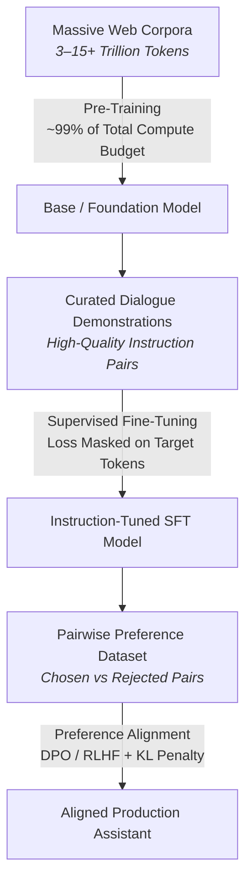
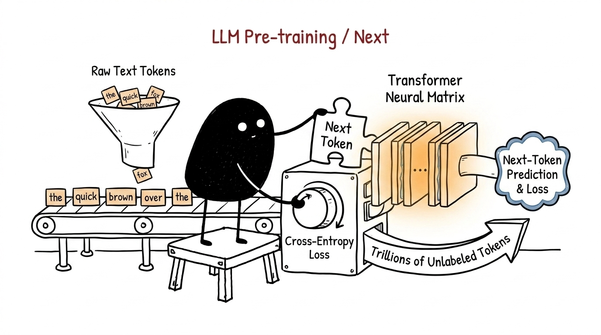
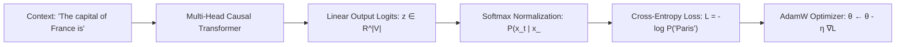
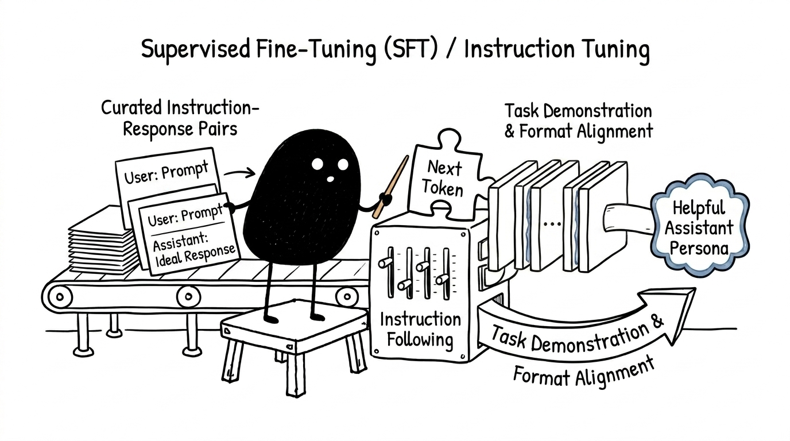
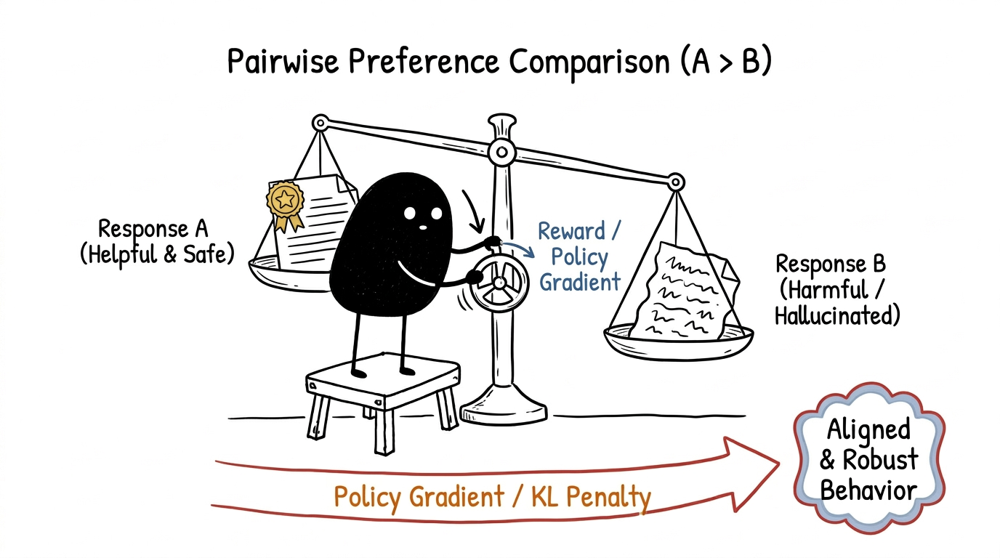
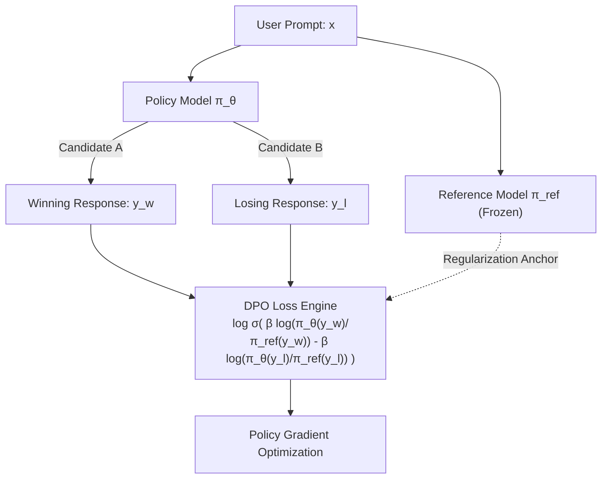

# How a Large Language Model Is Trained

An end-to-end technical guide to Pre-training, Supervised Fine-Tuning (SFT), and Preference Alignment (RLHF / DPO).

## Overview: The Three Training Regimes

Training a modern Large Language Model (LLM) is not a single monolithic training run. It is an industrial machine learning pipeline divided into three distinct operational phases: **knowledge acquisition** (Pre-training), **conversational protocol adaptation** (Supervised Fine-Tuning), and **preference calibration** (Reinforcement Learning from Human Feedback / Direct Preference Optimization).

Each stage operates under radically different data scales, computational budgets, and optimization criteria. The journey begins with trillions of uncurated web tokens and ends with a calibrated, turn-taking assistant aligned with human intent.



## Tokenization and Numerical Representations

Neural networks cannot operate directly on arbitrary strings of Unicode text. Before any matrix multiplications occur, continuous text streams must be converted into a sequence of discrete integer identifiers selected from a predefined, immutable vocabulary $V$.

Modern language models rely almost universally on subword tokenization schemes such as **Byte-Pair Encoding (BPE)** (utilized by GPT-4 and LLaMA) or **WordPiece / Unigram** (utilized by Gemini and Gemma).

### The Subword Tokenization Algorithm

BPE begins with a base vocabulary consisting of all individual byte values (256 raw bytes). It then iteratively scans a massive reference text corpus, counting all adjacent pairs of symbols, and iteratively merges the single most frequently occurring symbol pair into a new subword unit. This merge process repeats until the target vocabulary size $|V|$ (typically ranging between $32{,}000$ and $128{,}256$ entries) is satisfied.

```python
# Conceptual representation of tokenization
text = "Antigravity models learn by predicting"
token_ids = [15420, 2984, 4392, 1205, 14389]  # Integer indices into vocabulary V
```

Each token integer $x_t \in \{0, 1, \dots, |V|-1\}$ serves as a row index into an embedding matrix $\mathbf{W}_e \in \mathbb{R}^{|V| \times d_{\text{model}}}$, where $d_{\text{model}}$ is the hidden dimension of the transformer (e.g., $d_{\text{model}} = 4096$). The resulting vector represents the token in a continuous vector space before adding positional encodings.

## Pre-Training: The Foundation Model

Pre-training represents the most computationally demanding phase of LLM development, routinely consuming **98% to 99% of the overall GPU FLOPs budget** and millions of dollars in electricity. During this phase, the neural network learns world facts, syntactic patterns, programming languages, reasoning heuristics, and semantic relationships purely through self-supervised autoregressive next-token prediction.



### The Autoregressive Objective Function

During pre-training, the model processes billions of unstructured text documents sourced from Common Crawl, Wikipedia, GitHub, and academic publications. The model learns by playing a continuous game of fill-in-the-blank across sequences of length $T$.

Given an input sequence of tokens $\mathbf{x} = (x_1, x_2, \dots, x_T)$, the model is trained to maximize the log-likelihood of every token conditioned strictly on the preceding context. To prevent information leakage from future tokens, self-attention layers employ a **causal lower-triangular attention mask**, setting attention weights from position $i$ to position $j > i$ to $-\infty$.

The empirical loss function minimized across all training batches is the standard **Cross-Entropy Loss**:

$$\mathcal{L}_{\text{pretrain}}(\theta) = - \frac{1}{T} \sum_{t=1}^T \log P_\theta(x_t \mid x_1, x_2, \dots, x_{t-1})$$

The transformation pipeline from context tokens to updated weights follows a continuous forward and backward propagation loop:



### Concrete Forward and Backward Pass Calculation

To understand the exact mechanics of a parameter update, consider a toy vocabulary of four tokens: $V = \{\text{"apple"}: 0, \text{"banana"}: 1, \text{"cat"}: 2, \text{"dog"}: 3\}$. 

Suppose the model receives the context `"The pet is a"` and the true target continuation is `"cat"` ($y = 2$).

1. **Logit Projection**: The final hidden state vector $\mathbf{h} \in \mathbb{R}^{d_{\text{model}}}$ is multiplied by the unembedding matrix $\mathbf{W}_u \in \mathbb{R}^{|V| \times d_{\text{model}}}$:
   $$\mathbf{z} = \mathbf{W}_u \mathbf{h} = [2.10, \; 0.40, \; 4.80, \; 1.20]$$

2. **Softmax Normalization**:
   $$P(x_t = i \mid \mathbf{x}_{<t}) = \frac{e^{z_i}}{\sum_{j=0}^{3} e^{z_j}}$$
   $$e^{\mathbf{z}} \approx [8.166, \; 1.492, \; 121.510, \; 3.320] \implies \sum_{j=0}^3 e^{z_j} = 134.488$$
   $$\mathbf{p} = [0.0607, \; 0.0111, \; \mathbf{0.9035}, \; 0.0247]$$

3. **Loss Evaluation**:
   $$\mathcal{L} = -\log(p_2) = -\log(0.9035) \approx 0.1015$$

4. **Analytical Gradient with Respect to Logits**:
   $$\frac{\partial \mathcal{L}}{\partial z_i} = p_i - \mathbf{1}_{\{i = y\}} = [0.0607, \; 0.0111, \; -0.0965, \; 0.0247]$$

The optimizer (typically AdamW with cosine learning rate decay and warmup) backpropagates these gradients through all transformer attention blocks and feed-forward layers to update the parameters $\theta$:

$$\theta_{t+1} = \theta_t - \eta_t \cdot \frac{\mathbf{m}_t}{\sqrt{\mathbf{v}_t} + \epsilon} - \lambda \eta_t \theta_t$$

<video controls autoplay loop muted playsinline width="100%" style="border-radius:8px; margin: 24px 0; border: 1px solid var(--panel-border);">
  <source src="gradient_descent.mp4" type="video/mp4">
  Your browser does not support the video tag.
</video>

### Empirical Scaling Laws & Chinchilla Optimality

The allocation of compute between model parameters $N$ and training dataset tokens $D$ is governed by empirical scaling laws. Hoffmann et al. (DeepMind Chinchilla) demonstrated that for compute-optimal training under a fixed compute budget $C \approx 6ND$:

$$N_{\text{optimal}} \propto C^{0.5}, \quad D_{\text{optimal}} \propto C^{0.5}$$

Historically, early models were significantly undertrained relative to their parameter capacity (e.g., GPT-3 with 175B parameters trained on only 300B tokens). Today, models are trained with a token-to-parameter ratio of at least $20:1$ to $100:1$ (e.g., LLaMA-3 with 8B parameters trained on over 15 Trillion tokens), trading increased pre-training compute for significantly cheaper per-token inference costs.

## Supervised Fine-Tuning: Instruction Alignment

A base foundation model is an unconditional probabilistic text predictor. If given the user prompt `"Write a Python function to compute Fibonacci numbers"`, a base model is as likely to generate another exam question as it is to write the solution, because web text contains numerous lists of programming exercises.

**Supervised Fine-Tuning (SFT)** (also termed **Instruction Tuning**) conditions the raw model to adopt the persona of an obedient, turn-taking AI assistant that follows instructions rather than simply continuing text.



### Prompt Formats and Delimiter Tokens

Conversational datasets are serialized into linear token streams using special delimiter tokens (such as ChatML syntax) that the model cannot emit under standard text distributions. These markers define clear semantic boundaries between system instructions, user inputs, and model outputs:

```text
<|im_start|>system
You are a concise, helpful assistant.<|im_end|>
<|im_start|>user
What is the speed of light in a vacuum?<|im_end|>
<|im_start|>assistant
The speed of light in a vacuum is exactly 299,792,458 meters per second.<|im_end|>
```

### The Loss Masking Mechanism

During SFT, standard cross-entropy loss is applied, but with a critical modification: **loss masking**. The loss contribution and corresponding gradient are strictly zeroed out for all tokens belonging to the system prompt and the user's turn:

$$\mathcal{L}_{\text{SFT}}(\theta) = - \sum_{t \in \text{Assistant Tokens}} \log P_\theta(x_t \mid x_1, x_2, \dots, x_{t-1})$$

If the model were forced to compute loss over the user's prompt tokens, it would expend valuable capacity attempting to model the distribution of arbitrary user questions, degrading its ability to generate high-quality, structured responses.

```mermaid
flowchart TD
    subgraph Data ["Structured Input Sequence"]
        U["User Prompt:<br/>&lt;|im_start|&gt;user\nWhat is the speed of light?&lt;|im_end|&gt;"]
        A["Assistant Response:<br/>&lt;|im_start|&gt;assistant\nThe speed of light is ~300,000 km/s.&lt;|im_end|&gt;"]
    end
    U -.->|Loss Mask = 0<br/>(Gradients Zeroed Out)| L["Cross-Entropy Loss Computation"]
    A ==>|Loss Mask = 1<br/>(Compute Gradient)| L
    L --> UPT["Fine-Tune Model Weights θ"]
```

High-quality SFT requires relatively few examples (typically between $10{,}000$ and $1{,}000{,}000$ curated dialogues) compared to pre-training. Modern pipelines frequently utilize synthetic instruction generation (e.g. UltraChat, Evol-Instruct) validated by automated filtering heuristics to ensure diverse task coverage.

## Preference Alignment: RLHF and Direct Preference Optimization

While SFT models learn the format of conversation, supervised maximum likelihood training suffers from two fundamental limitations:
1. **Exposure Bias**: During generation, errors accumulate autoregressively because the model conditions on its own prior sampled tokens rather than ground-truth tokens.
2. **Objective Mismatch**: Supervised training penalizes all deviations from reference tokens equally, unable to distinguish between a harmless stylistic synonym and a critical factual hallucination or safety violation.

Preference alignment steers the model's policy distribution toward human-desirable behaviors (helpfulness, truthfulness, and harmlessness) using pairwise comparative judgements.



### The Bradley-Terry Preference Model

Human annotators or specialized AI evaluator models are presented with a prompt $x$ and a pair of completions $(y_w, y_l)$, where $y_w$ is the preferred (winning) response and $y_l$ is the dispreferred (losing) response.

Under the Bradley-Terry formulation, the probability that completion $y_w$ is preferred over $y_l$ is modeled as:

$$P(y_w \succ y_l \mid x) = \sigma\left(r(x, y_w) - r(x, y_l)\right) = \frac{1}{1 + e^{-(r(x, y_w) - r(x, y_l))}}$$

where $r(x, y)$ is a scalar reward value representing the quality of response $y$ for prompt $x$.

### PPO vs. Direct Preference Optimization (DPO)

The alignment literature has evolved from complex reinforcement learning pipelines to elegant direct optimization algorithms:

#### Classical RLHF via Proximal Policy Optimization (PPO)
In traditional RLHF (introduced by Christiano et al. and Ouyang et al.):
1. A separate **Reward Model** $r_\psi(x, y)$ is first trained on preference pairs via binary cross-entropy.
2. The language model policy $\pi_\theta$ is then optimized using PPO against the reward model with a **Kullback-Leibler (KL) divergence penalty**:
   $$\max_\theta \; \mathbb{E}_{x \sim \mathcal{D}, y \sim \pi_\theta}\left[ r_\psi(x, y) - \beta \mathbb{D}_{\text{KL}}\left(\pi_\theta(y \mid x) \parallel \pi_{\text{ref}}(y \mid x)\right) \right]$$

The frozen reference policy $\pi_{\text{ref}}$ ensures the model does not suffer from *reward hacking* (e.g., generating endless repetitive text that exploits flaws in the reward model) or catastrophic forgetting of base linguistic competencies.

#### Direct Preference Optimization (DPO)
Rafailov et al. (2023) showed that the constrained RL problem has an exact analytical solution. The implicit reward can be expressed directly in terms of log-probabilities:

$$r(x, y) = \beta \log \frac{\pi_\theta(y \mid x)}{\pi_{\text{ref}}(y \mid x)}$$

Substituting this directly into the Bradley-Terry objective yields the **DPO Loss Function**:

$$\mathcal{L}_{\text{DPO}}(\theta) = - \mathbb{E}_{(x, y_w, y_l) \sim \mathcal{D}} \left[ \log \sigma \left( \beta \log \frac{\pi_\theta(y_w \mid x)}{\pi_{\text{ref}}(y_w \mid x)} - \beta \log \frac{\pi_\theta(y_l \mid x)}{\pi_{\text{ref}}(y_l \mid x)} \right) \right]$$



DPO completely eliminates the need to train a standalone reward model, sample dynamic rollouts during training, or tune delicate PPO hyperparameter schedules.

## Pipeline Comparison Matrix

The following table summarizes the structural differences across the three core training stages:

| Dimension | Pre-Training | Supervised Fine-Tuning (SFT) | Preference Alignment (DPO / RLHF) |
| :--- | :--- | :--- | :--- |
| **Primary Goal** | Knowledge acquisition & linguistic modeling | Instruction following & dialogue format alignment | Nuanced preference calibration & safety guardrails |
| **Data Format** | Unstructured text documents (web, code, books) | Multi-turn prompt & ideal response pairs | Triplets of `(prompt, winning_response, losing_response)` |
| **Data Scale** | $3\text{T} - 15\text{T}+$ tokens | $10{,}000 - 1{,}000{,}000$ high-quality examples | $50{,}000 - 500{,}000$ comparison pairs |
| **Loss Function** | Causal Next-Token Cross-Entropy | Masked Response Cross-Entropy | Direct Preference Optimization (DPO) / PPO Loss |
| **Compute Budget** | $\approx 98\% - 99\%$ of total FLOPs | $< 1\%$ of total FLOPs | $\approx 1\%$ of total FLOPs |
| **Hardware Setup** | Thousands of GPUs (Megatron-LM, FSDP, TP/PP/EP) | Hundreds of GPUs (FSDP, LoRA / Full Parameter) | Hundreds of GPUs (Policy + Reference Model) |
| **Output Artifact** | Base Foundation Model (e.g. `LLaMA-3-8B-Base`) | Instruct/Chat Model (e.g. `LLaMA-3-8B-SFT`) | Aligned Assistant (e.g. `LLaMA-3-8B-Instruct`) |

## Self-Check Diagnostic Quiz

Test your understanding of the end-to-end training pipeline:

<div class="quiz-container">
  <div class="quiz-question">
    <div class="quiz-q-text">1. Why is loss masking applied to user prompt tokens during Supervised Fine-Tuning (SFT)?</div>
    <div class="quiz-options">
      <button class="quiz-opt" data-correct="true">To focus the model's gradient updates entirely on generating high-quality assistant responses rather than predicting arbitrary user query syntax.</button>
      <button class="quiz-opt" data-correct="false">Because user prompts are encrypted across distributed GPU tensor parallel shards.</button>
      <button class="quiz-opt" data-correct="false">To prevent the model from learning the vocabulary embedding mappings of user tokens.</button>
      <button class="quiz-opt" data-correct="false">To reduce GPU VRAM consumption to zero during the forward pass.</button>
    </div>
    <div class="quiz-feedback"></div>
  </div>

  <div class="quiz-question">
    <div class="quiz-q-text">2. What critical problem does the KL-divergence penalty \( \mathbb{D}_{\text{KL}}(\pi_\theta \parallel \pi_{\text{ref}}) \) solve in RLHF and DPO?</div>
    <div class="quiz-options">
      <button class="quiz-opt" data-correct="true">It prevents reward hacking and ensures the policy does not drift uncontrollably away from its original linguistic capabilities.</button>
      <button class="quiz-opt" data-correct="false">It calculates the exact learning rate schedule for the AdamW optimizer.</button>
      <button class="quiz-opt" data-correct="false">It automatically quantizes the model weights from FP16 down to INT4 precision.</button>
      <button class="quiz-opt" data-correct="false">It allows the transformer to exceed its maximum context window length.</button>
    </div>
    <div class="quiz-feedback"></div>
  </div>

  <div class="quiz-question">
    <div class="quiz-q-text">3. According to the Chinchilla scaling laws, what is the compute-optimal strategy when scaling total FLOPs budget?</div>
    <div class="quiz-options">
      <button class="quiz-opt" data-correct="true">Scale model parameter count and dataset token count in equal proportions (N ∝ C^0.5, D ∝ C^0.5).</button>
      <button class="quiz-opt" data-correct="false">Keep dataset size fixed at 300B tokens and increase parameter count exponentially.</button>
      <button class="quiz-opt" data-correct="false">Triple the learning rate while keeping batch size constant.</button>
      <button class="quiz-opt" data-correct="false">Scale the context window length quadratically with parameter count.</button>
    </div>
    <div class="quiz-feedback"></div>
  </div>

  <div class="quiz-question">
    <div class="quiz-q-text">4. In next-token cross-entropy loss with vocabulary size |V|, what is the exact gradient with respect to logit z_i when token k is the ground truth target?</div>
    <div class="quiz-options">
      <button class="quiz-opt" data-correct="true">p_i - 1 if i = k, otherwise p_i (i.e. p_i - y_i).</button>
      <button class="quiz-opt" data-correct="false">log(p_i) multiplied by the hidden dimension d_model.</button>
      <button class="quiz-opt" data-correct="false">The inverse square root of the attention head dimension.</button>
      <button class="quiz-opt" data-correct="false">Zero for all vocabulary indices except the maximum logit.</button>
    </div>
    <div class="quiz-feedback"></div>
  </div>

  <div class="quiz-question">
    <div class="quiz-q-text">5. What is the fundamental operational advantage of Direct Preference Optimization (DPO) over classical PPO-based RLHF?</div>
    <div class="quiz-options">
      <button class="quiz-opt" data-correct="true">DPO analytically expresses the reward in terms of policy probabilities, removing the need to train a separate reward model or sample dynamic rollouts during training.</button>
      <button class="quiz-opt" data-correct="false">DPO avoids using gradient descent by solving parameters via matrix inversion.</button>
      <button class="quiz-opt" data-correct="false">DPO completely eliminates the need for human or AI preference comparison data.</button>
      <button class="quiz-opt" data-correct="false">DPO converts decoder-only transformers into encoder-decoder architectures.</button>
    </div>
    <div class="quiz-feedback"></div>
  </div>
</div>
