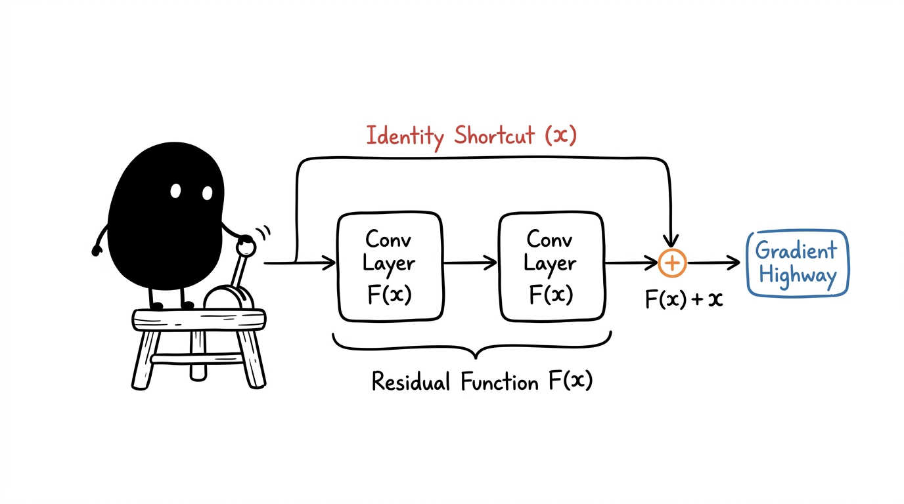
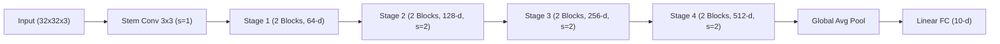

# Model Baselines and ResNet-18 Explained

Understanding reference architectures, residual learning mechanics, and gradient propagation.

## The Role of Model Baselines

In empirical machine learning, a baseline is a well-characterized reference architecture evaluated under standardized training conditions. Rather than inventing novel components immediately, practitioners establish a baseline to measure the true performance floor and isolate whether subsequent architectural changes yield genuine statistical improvements.

For image classification benchmarks like SVHN and CIFAR-10, convolutional baselines range from classical shallow networks like LeNet-5 to standard residual topologies like ResNet-18. A baseline anchors error analysis, highlighting failure modes such as overfitting, spatial distractor interference, or optimization stagnation before introducing heavier backbones.

## The Vanishing Gradient and Degradation Problem

As neural networks grow deeper, repeated matrix multiplications during backpropagation cause gradient signals to either explode or decay exponentially toward zero. Even with batch normalization and normalized weight initializations mitigating vanishing gradients, extremely deep plain networks exhibit a degradation problem: adding more layers leads to higher training error, because standard layers struggle to fit an identity mapping $\mathcal{H}(x) = x$.

Residual networks resolve this by reformulating the objective. Instead of requiring stacked layers to approximate an unconstrained mapping $\mathcal{H}(x)$, the network optimizes a residual mapping $\mathcal{F}(x) = \mathcal{H}(x) - x$.

$$\mathcal{H}(x) = \mathcal{F}(x) + x$$

When an identity mapping is optimal, gradient descent simply drives the residual weights $\mathcal{F}(x) \rightarrow 0$, leaving the identity path intact without learning degradation.



## Anatomical Breakdown of ResNet-18

ResNet-18 consists of exactly 18 parameterized weight layers: one 3×3 convolutional input stem, eight 2-layer residual basic blocks organized into four resolution stages, and one final fully connected linear layer.



<video controls autoplay loop playsinline width="100%" style="border-radius:8px; margin: 20px 0; border: 1px solid var(--panel-border);">
  <source src="resnet_audio_walkthrough.mp4" type="video/mp4">
  Your browser does not support the video tag.
</video>

Each basic residual block contains two 3×3 convolutions with batch normalization and ReLU activations. Across the four stages, feature spatial dimensions halve while channel capacities double ($64 \rightarrow 128 \rightarrow 256 \rightarrow 512$), yielding a total parameter budget of approximately 11.2 million parameters.

```python
import torch
import torch.nn as nn

class BasicBlock(nn.Module):
    def __init__(self, in_planes, planes, stride=1):
        super().__init__()
        self.conv1 = nn.Conv2d(in_planes, planes, kernel_size=3, stride=stride, padding=1, bias=False)
        self.bn1 = nn.BatchNorm2d(planes)
        self.conv2 = nn.Conv2d(planes, planes, kernel_size=3, stride=1, padding=1, bias=False)
        self.bn2 = nn.BatchNorm2d(planes)
        
        self.shortcut = nn.Sequential()
        if stride != 1 or in_planes != planes:
            self.shortcut = nn.Sequential(
                nn.Conv2d(in_planes, planes, kernel_size=1, stride=stride, bias=False),
                nn.BatchNorm2d(planes)
            )

    def forward(self, x):
        out = torch.relu(self.bn1(self.conv1(x)))
        out = self.bn2(self.conv2(out))
        out += self.shortcut(x)
        return torch.relu(out)
```

## Numerical Walkthrough on a 32x32 SVHN Image

Tracing a single 32×32 RGB SVHN image through the network demonstrates how dimensions transform across each stage.

For a modified CIFAR/SVHN stem (3×3 conv with stride 1, padding 1), the spatial resolution is preserved at 32×32:

1. **Input Tensor**: Dimensions are $1 \times 3 \times 32 \times 32$.
2. **Stem Layer**: Conv 3×3 with 64 filters maps tensor to $1 \times 64 \times 32 \times 32$.
3. **Stage 1**: Two basic blocks maintain $1 \times 64 \times 32 \times 32$ without downsampling.
4. **Stage 2**: First block uses stride 2; tensor contracts to $1 \times 128 \times 16 \times 16$.
5. **Stage 3**: First block uses stride 2; tensor contracts to $1 \times 256 \times 8 \times 8$.
6. **Stage 4**: First block uses stride 2; tensor contracts to $1 \times 512 \times 4 \times 4$.
7. **Global Average Pooling**: Spatial dimensions collapse across $4 \times 4$, producing a 512-dimensional vector ($1 \times 512 \times 1 \times 1$).
8. **Classifier**: Linear layer transforms 512 features into 10 class logits ($1 \times 10$).

During backpropagation, the gradient of the loss $\mathcal{L}$ with respect to the input $x$ of a residual block decomposes into:

$$\frac{\partial \mathcal{L}}{\partial x} = \frac{\partial \mathcal{L}}{\partial \mathcal{H}} \cdot \left( \frac{\partial \mathcal{F}}{\partial x} + 1 \right) = \frac{\partial \mathcal{L}}{\partial \mathcal{H}} \frac{\partial \mathcal{F}}{\partial x} + \frac{\partial \mathcal{L}}{\partial \mathcal{H}}$$

The $+ \frac{\partial \mathcal{L}}{\partial \mathcal{H}}$ term guarantees an uninterrupted gradient highway back to early layers, preventing gradient collapse regardless of network depth.

## Knowledge Check

<div class="quiz-container">
  <div class="quiz-question">
    <div class="quiz-q-text">1. Why does the shortcut connection $\mathcal{F}(x) + x$ prevent degradation in deep networks?</div>
    <div class="quiz-options">
      <button class="quiz-opt" data-correct="true">It allows gradients to flow directly through the identity term without vanishing, and enables layers to easily learn identity mappings by driving weights to zero.</button>
      <button class="quiz-opt" data-correct="false">It compresses the input dimensionality using PCA before running convolutions.</button>
      <button class="quiz-opt" data-correct="false">It eliminates the need for non-linear activation functions like ReLU across all layers.</button>
    </div>
    <div class="quiz-feedback"></div>
  </div>
  <div class="quiz-question">
    <div class="quiz-q-text">2. How many parameterized convolutional layers are present across the four residual stages of ResNet-18?</div>
    <div class="quiz-options">
      <button class="quiz-opt" data-correct="true">16 convolutional layers (4 stages × 2 blocks × 2 conv layers per block).</button>
      <button class="quiz-opt" data-correct="false">18 convolutional layers.</button>
      <button class="quiz-opt" data-correct="false">8 convolutional layers.</button>
    </div>
    <div class="quiz-feedback"></div>
  </div>
</div>
